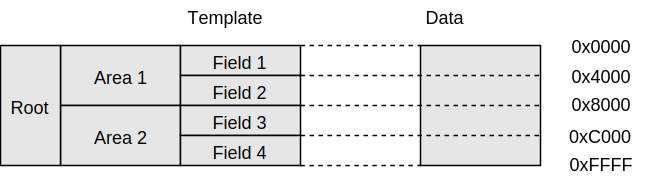
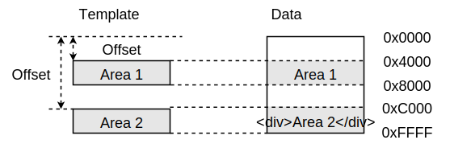
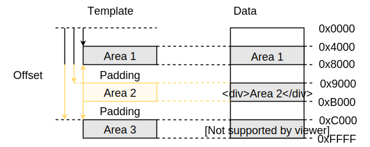
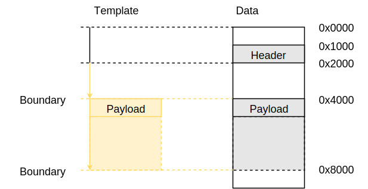

.. _template:

=========
Templates
=========

A template represents the central concept of Binalyzer. It is used to describe
the layout of binary data. There need not to be necessarily a 1-to-1 relationship
between a template and data. The same piece of data may be bound to several
templates and vice versa. This also means, that a template does not need to
describe some binary data completely. It just describes the parts of
interest. This flexibility allows for covering many use cases. It is all about
projecting a structure onto a plain sequence of bytes making it easily accessible.

Let's start with a basic template like this:

.. code-block:: xml

    <template size="0x8000">
    </template>

This shows a single XML element that represents a template in the context of
Binalyzer. It is bound to some data starting from offset 0x0000 to 0x7FFF.

**Unique Identifier**

Templates are identified by a unique identifier. The
:class:`~binalyzer.template.Template.name` attribute is used to uniquely identify
a template. This identifier is used by the template object model to access the
particular part of the binary data.

.. code-block:: xml

    <template name="root" size="0x8000">
    </template>

.. note:: It is notable that the XML element name can be freely chosen and has no
          impact onto the template object model. It's sole purpose is to annotate
          the data format description.

Nesting Templates
=================

Templates can be nested, so that parent elements consist of one or more child
elements that are bound to data. Here's an example where templates are
nested:

.. code-block:: xml

    <template name="root">
        <area name="area-1">
            <field name="field-1" size="0x4000"></field>
            <field name="field-2" size="0x4000"></field>
        </area>
        <area name="area-2">
            <field name="field-3" size="0x4000"></field>
            <field name="field-4" size="0x4000"></field>
        </area>
    </template>

Placing Templates
=================

Placing determines the position of a template within binary data. The following
attributes are used to set the position of a template:

    * :ref:`offset`
    * :ref:`size`
    * :ref:`padding`
    * :ref:`boundary`

.. _offset:

Offset
------

A template's offset defines its arrangement within the data it is bound to. By
default the offset is interpeted as relative to its parent template. Using the
Origin, this behaviour may be changed to be relative to either the beginning or
the end of data. If there is no offset specified, it is calculated depending on
its position in the template object model. The offset calculation is influenced
by the size and padding of the template's siblings.

.. code-block:: xml

    <template name="root">
        <area name="area-1" offset="0x4000" size="0x4000"></area>
        <area name="area-2" offset="0xC000" size="0x4000"></area>
    </template>

.. note:: If a node's offset is greater than the total size of its siblings it
          increases its parent node's size.

Origin and Addressing Mode
""""""""""""""""""""""""""

The origin and addressing mode attributes determine the way the offset is used
to place a template.

====== =============== ========================================================
Origin Addressing Mode Description
====== =============== ========================================================
begin  relative        Offset is relative to begin of parent template (default)
end    relative        Offset is relative to end of parent template
begin  absolute        Offset is relative to begin of root template
end    absolute        Offset is relative to end of root template
====== =============== ========================================================

.. _size:

Size
----

A template's size attribute sets the size of a particular data area. If the size of a
template is not explicitly set, the size is calculated using its children. In
the following example the size of the layout is the sum of the sizes of its
children.

.. code-block:: xml

    <template>
        <layout>
            <section size="32"></section>
            <section size="32"></section>
            <section size="32"></section>
            <section size="32"></section>
        </layout>
    </template>

.. note:: The size of a template may be affected by the :ref:`offset`,
          :ref:`padding` or :ref:`boundary` attributes of other templates.

Sizing
------

The ``size`` of a template can be fixed or calculated dynamically. The ``sizing``
attribute determines the usage of the ``size`` attribute.

======= ========================================================
Sizing  Description
======= ========================================================
auto    Determine the size of a template by its children
fix     Use a fixed size determined by the ``size`` attribute
stretch Stretch a template until next sibling or parent template
======= ========================================================

fix
""""

The following example sets the ``size`` of the template to a fixed value.

.. code-block:: xml

    <template size="64" sizing="fix">
    </template>

.. note:: The ``sizing`` attribute is optional. If a ``size`` is given, it
          defaults to ``fix``.

auto
""""

If a parent template uses ``auto`` sizing, the template's size conforms to the
size of its children.

.. code-block:: xml

    <template sizing="auto">
        <area size="32"></area>
    </template>

.. note:: The ``sizing`` attribute is optional. If no ``size`` is specified,
          it defaults to ``auto``.

stretch
"""""""

Stretching a template increases its size until its next sibling. In case there
is no sibling, the size increases until the parent template is filled. This
behaviour is specified by setting the ``sizing`` attribute to ``stretch``.

.. code-block:: xml

    <template size="64">
        <area size="32"></area>
        <area sizing="stretch" size="16"></area>
    </template>

.. note:: If a ``size`` is provided with the ``sizing`` attribute set to
          ``stretch``, it specifies the minimum size to use.

.. _padding:

Padding
-------

A padding is specified using the attributes ``padding-before`` and
``padding-after``. It is typically used to specify some space between
templates either before or after a them.

.. code-block:: xml

    <template name="root">
        <area name="area-1" offset="0x4000" size="0x4000"></area>
        <area name="area-2"
              size="0x2000"
              padding-before="0x1000"
              padding-after="0x1000">
        </area>
        <area name="area-3" size="0x4000"></area>
    </template>

.. _boundary:

Boundary
--------

The boundary attribute is used to specify a boundary for a particular data
area. It influences the offset as well as the size of the template. The offset
and size values are calculated to be always a multiple of the boundary.

.. note:: If either the offset or the size is explicitly set, it overrides the
          effect of the boundary attribute.

In the example below, the area named ``payload`` should start and end at a
boundary of 0x20. The ``header`` has a relative offset of 0x10, therefore
``payload`` will start at the absolute offset 0x20 and has a size of 0x20 bytes.

.. code-block:: xml

    <template>
        <layout>
            <area name="header" offset="0x10"></area>
            <area name="payload" boundary="0x20"></area>
        </layout>
    </template>

**Size Override**

The following listing is an example of how to override the size attribute of a
data element. In this case, the boundary does not affect the size parameter.
The boundary attribute soley ensures that the data area starts at a multiple
of the boundary.

.. code-block:: xml

    <template>
        <layout>
            <area size="0x300" boundary="0x200"></area>
        </layout>
    </template>

**Template Wrapping**

Wrapping a data area ensures that it does not only start at a multiple of the
boundary, but also that it ends at the boundary taking the size of its inner
element into account.

.. code-block:: xml

    <template>
        <layout>
            <wrapper boundary="0x200"></area>
                <area size="0x300"></area>
            </wrapper>
        </layout>
    </template>

.. _revolvable_value:

Templates and Data
==================

Text Attribute
--------------

The `text` attribute is used to store static information in the template 
description. It can be read by an application and applied to a template value.

This is usually used to replace parts of Binary data. It helps in keeping 
structural information and data together.

.. code-block:: xml

    <?xml version="1.0" encoding="UTF-8" standalone="no" ?>
    <template>
        <!-- Small byte values can be written into the text attribute -->
        <field name="field0" text="0x11223344"></field>
        <!-- Larger byte values can be written as element content -->
        <field name="field2">
            DE AD BE EF AA 55 AA 55
            AA 55 AA 55 AA 55 AA 55
        </field>
    </template>

If a `text` attribute is used and there is no `size` is specified, the template
derives the size from the content of the `text` attribute. 

.. code-block:: xml

    <field name="field0" text="0x11223344"></field>

If a template element contains content and no size attribute is explicitly set, 
the template's size is determined by the length of the templates content. The 
following template has a size of 4 bytes derived from its content.

.. code-block:: xml

    <field name="field1">
        DE AD BE EF AA 55 AA 55
        AA 55 AA 55 AA 55 AA 55
    </field>

The `text` attribute can be accessed from code by the `text` property.

.. code-block:: xml

    from binalyzer import examples

    binalyzer = Binalyzer().xml.from_file(examples.text_template_filepath)
    
    dump(binalyzer.template.field0.text)

    print(f"Total size: 0x{template.size:02X}")
    print(f"Size of field 0: 0x{template.field0.size:02X}")
    print(f"Size of field 1: 0x{template.field1.size:02X}")

Signature Attribute
-------------------

The `signature` attribute determines a sequence of byte values that is expected
at a specific address.

Hint Attribute
--------------

The `hint` attribute is used to give additional hints to the XML parser. At the 
moment the only hint that is supporde it `optional`. It specifies whether a 
`signature` is optional. Its mandatory by default.

Data Binding
------------

The values of template attributes do not need to be hardcoded. They may be
resolved from data other templates are bound to. Here's an example.

.. code-block:: xml

    <template name="root">
        <header name="header-0">
            <field name="boundary" size="4"></field>
        </header>
        <section name="section-0" boundary="{boundary}"></section>
        <section name="section-1" boundary="{boundary}"></section>
        <section name="section-2" boundary="{boundary}"></section>
    </template>

**Byte Order**

The byte order can be specified using the ``byteorder`` parameter. If nothing is
specified, the byte order defaults to ``little``.

.. code-block:: xml

    <section name="section-0" boundary="{boundary}"></section>
    <section name="section-1" boundary="{boundary, byteorder=little}"></section>
    <section name="section-2" boundary="{boundary, byteorder=big}"></section>

**Value Provider**

A value provider allows to convert data to a format that is required by an
attribute. The following example uses a value provider that converts a byte 
sequence encoded as `LEB128` to an integer that is usable by the `size` attribute. 

.. code-block:: xml

    <field name="length" size="{provider=wasm.leb128size}"></field>
    
It is also possible to convert a referenced value using a custom value provider.

.. code-block:: xml

    <blob name="data" size="{length, provider=wasm.leb128u}">

The `WASM format example` shows how to apply custom value providers. The WASM 
value providers can be found in the `binalyzer-wasm` package.

Dynamic Templates
=================

Templates may be created dynamically if the `count` attribute uses data binding.
Depending on the data provided the template will be created multiple times. Here
is an example.

.. code-block:: xml

Count Attribute
---------------

The count attribute is used to duplicate the template `n` times.

.. code-block:: xml

A template can be duplicated dynamically at runtime when data binding is used.

.. code-block:: xml
